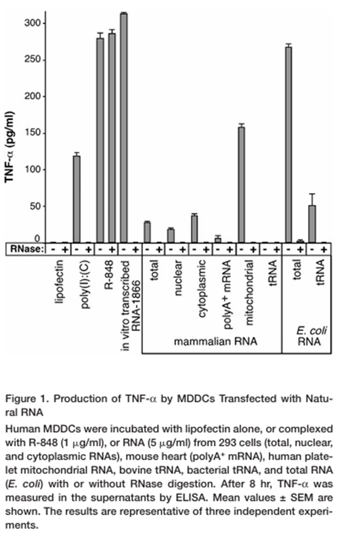
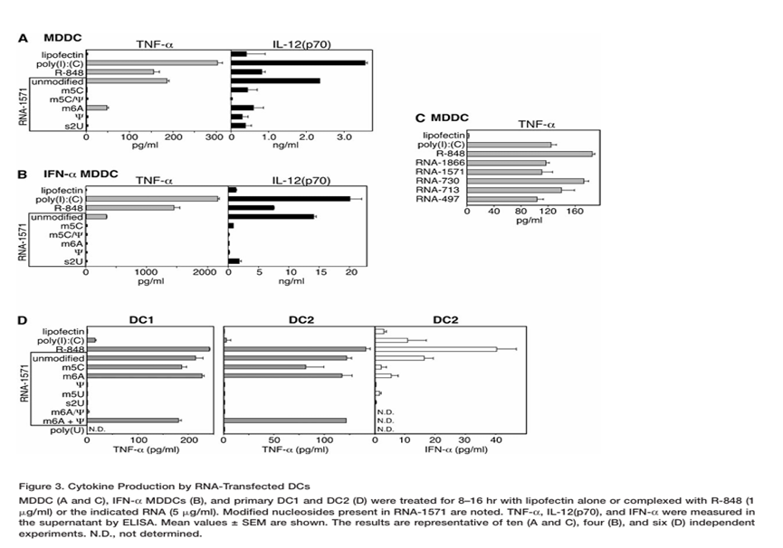

# 论文导读：mRNA 免疫逃逸的基石发现

* **所选论文标题：** Suppression of RNA recognition by Toll-like receptors: the impact of nucleoside modification and the evolutionary origin of RNA
* **出处（期刊/会议、年份）：** *Immunity*, 2005
* **使用的大模型名称：** Gemini

---

### 1. 研究背景与动机
在 2000 年代初，利用体外转录合成的 mRNA 作为疫苗或治疗药物的构想极具潜力，但面临一个致命瓶颈：合成的 mRNA 注入体内后，会被人体的先天免疫系统（特别是树突状细胞）识别为外源病原体，从而引发强烈的炎症反应，并在翻译出目标蛋白之前被降解。
Karikó 和 Weissman 观察到一个有趣的现象：人体自身的哺乳动物细胞内充满了 RNA，但免疫系统并不会攻击这些“自我”的 RNA。他们推测，哺乳动物 RNA 中大量存在的“核苷酸化学修饰”（Nucleoside modification）可能是其逃避免疫识别的“隐身衣”。本研究的动机正是为了验证这一假说，寻找消除合成 mRNA 免疫原性的方法。

### 2. 核心方法
研究团队运用了体外转录技术，合成了包含不同天然核苷酸修饰（如假尿苷 Ψ、5-甲基胞苷 m5C、6-甲基腺苷 m6A 等）的 RNA 以及未经修饰的标准 RNA。
随后，他们将这些 RNA 分别递送至人类树突状细胞（DCs）以及表达特定 Toll 样受体（TLR3, TLR7, TLR8）的免疫细胞中。通过酶联免疫吸附测定（ELISA）等分子生物学手段，精确测量细胞受刺激后分泌的炎症细胞因子（如 TNF-α, IL-12, IFN-α）水平以及免疫激活标志物的表达情况。

*图1：原文 Figure 1。对比不同来源（哺乳动物 vs. 细菌）天然 RNA 对人类树突状细胞（MDDCs）的免疫刺激效果。*
### 3. 主要结果
实验结果取得了颠覆性的突破：
1. **强烈的免疫激活：** 未修饰的 RNA（如细菌 RNA 或体外合成的标准 RNA）会强烈激活 TLR3、TLR7 和 TLR8，导致树突状细胞释放大量的炎症细胞因子。
2. **免疫原性的消除：** 引入核苷酸修饰（尤其是假尿苷 Ψ 和 m5C）的 RNA，其激活免疫反应的能力被彻底消除（Ablated）。经过修饰的 RNA 处理的免疫细胞，其炎症因子分泌量几乎降至基线水平。
3. **免疫识别机制解析：** 先天免疫系统正是通过“检测 RNA 是否缺乏核苷酸修饰”来区分“自我”与“非我”（如入侵的细菌或坏死组织病毒）。核苷酸修饰成功阻断了 Toll 样受体对 RNA 的识别。

*图2：原文 Figure 3。核心诺奖证据图。展示了核苷酸修饰对 mRNA 免疫原性的影响。*

### 4. 个人小结
这篇文章是现代医学史上最具里程碑意义的文献之一。它不仅在基础免疫学上阐明了先天免疫系统识别外源核酸的进化机制，更在转化医学上彻底解决了 mRNA 技术的“致命缺陷”。如果没有这项关于“假尿苷修饰”的发现，合成 mRNA 就永远无法安全地用于人体，自然也就不会有后来在全球新冠疫情中拯救无数生命的 mRNA 疫苗（如 Pfizer-BioNTech 和 Moderna 疫苗）。这篇论文完美诠释了“基础科学突破如何转化为改变世界的颠覆性技术”。
